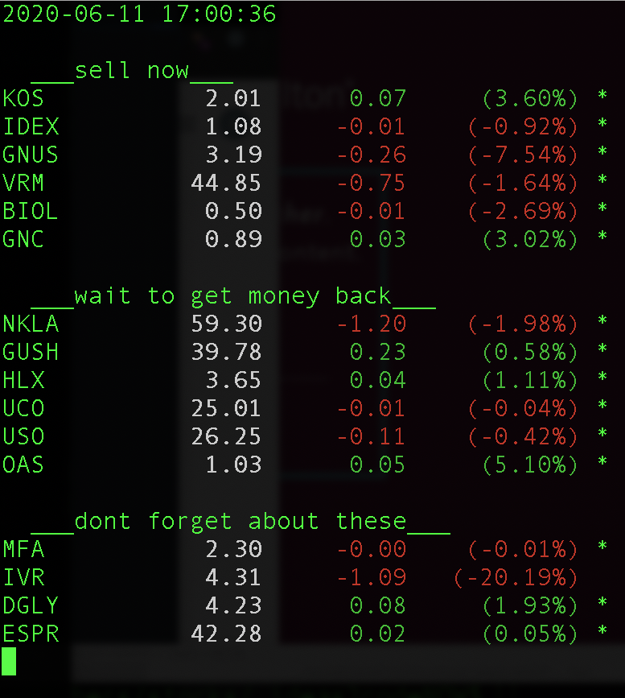

 # Stock Ticker
`stock_ticker.ipynb` integrates the amazing open source tool, `ticker.sh`. This script allows easy stock tickers display right in your terminal.  Its even colored, for easy identification of trends.

Since everyone who wants this tool isn't well versed in shell scripting, or programming at all, I have made a simple explanation on how to use it.  This `ipynb` file was written for use in a Google Colab Notebook.  The actual instructions for command line use are much easier.

Here is a sample output (with added lines about what to do with each company):

